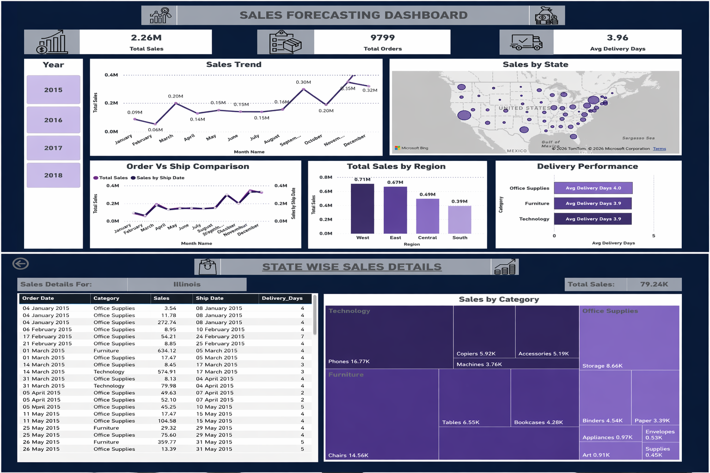

# 📊 Sales Dashboard (Power BI – Learning Project)

This dashboard was created as part of my Power BI learning journey to analyze sales performance and improve data modeling and visualization skills.

## 🔍 Key Features

* Sales trend analysis over time
* Order Date vs Ship Date comparison
* Region-wise performance using map visualization
* Drill-through for state-level insights
* Delivery performance analysis

## 🧠 Skills Applied

* Data Cleaning & Transformation (Power Query)
* Data Modeling (Date Table & Relationships)
* DAX Measures
* Interactive Dashboard Design

## 📁 Dataset

Superstore Sales Dataset (Kaggle)

## 📸 Dashboard Preview

## 🚀 Tools Used

* Power BI

---

💡 This is a practice project built to strengthen my data analytics skills. Feedback is welcome!

